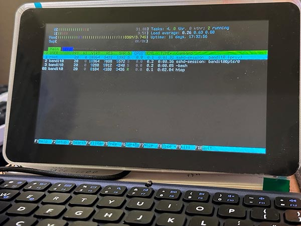

# Cyberdeck — ESP32-S3 SSH Terminal

A portable SSH (Secure Shell) terminal on the Waveshare ESP32-S3-Touch-LCD-7:
a 7" 800×480 touchscreen, a Bluetooth keyboard, WiFi, and `libssh2`. Turn it
on, tap a stored connection profile, and you are in a remote shell. The same
firmware also builds as a native Windows **simulator**, so you can try it
without the hardware.



## Highlights

- **A real SSH terminal** — password and public-key login (including
  passphrase-protected ed25519 keys), VT100/VT220/xterm emulation with 256
  colors and truecolor, alternate screen, and 1000 lines of scrollback.
  Rendering is measured and tuned, not hoped-for.
- **Bluetooth keyboard + touch UI** — pair once and it reconnects in the
  background; the touchscreen drives the profile picker and menus, with
  long-press for the in-session menu.
- **Easy onboarding** — get WiFi credentials and SSH profiles onto the
  device from your phone (QR code + temporary hotspot) or from a browser
  form on your PC. No cable, no config files required.
- **Lockable** — an optional access code encrypts stored keys and secrets
  at rest and gates the device behind a PIN pad at boot and wake. An
  enrolled phone can auto-lock the deck when you walk away.
- **Host-key pinning** — trust on first use: the first connect pins the
  server's SHA256 fingerprint, and a later mismatch blocks the connection
  before any credentials are sent.
- **CRT flavor, if you want it** — optional scanlines, glow, wobble and
  static; a digital-rain screensaver clock; three Terminus font sizes with
  a real bold face.
- **No framebuffer** — the screen is rasterized live, band by band, inside
  the LCD interrupt from an 8-byte-per-cell grid. That saves the ~750 KB a
  pixel buffer would cost.
- **Runs on your desktop** — the SDL simulator shares the exact render and
  shell code, so the sim looks and behaves like the hardware.

## Hardware

Waveshare **ESP32-S3-Touch-LCD-7**: 800×480 RGB LCD, GT911 capacitive
touch, ESP32-S3 at 240 MHz, 8 MB external PSRAM, 16 MB flash. Any Bluetooth
Low Energy keyboard should work. Pin map:
`components/display/lcd_driver.c`.

## Quick start

No git submodules — clone and build. The first configure downloads the
dependencies (libssh2, SDL2 for the sim, managed ESP-IDF components), so it
needs network access.

Connection details are **data, not firmware**. Copy the tracked skeleton
and fill in yours:

```bash
cp -r sim_storage.example sim_storage   # gitignored — edit profiles.ini, wifi.ini, keys/
```

The simulator reads `sim_storage/` directly; a full device flash bakes it
into the storage image. Everything is also editable later on the device
itself.

**Device** — requires ESP-IDF v5.1+; developed on v5.5.2:

```bash
idf.py set-target esp32s3               # first time
idf.py build
idf.py -p COMx flash monitor            # or -p /dev/ttyUSB0
```

After the first flash, prefer `idf.py app-flash` — the full `flash` target
rewrites the storage partition and wipes profiles and keys saved on the
device. On Windows, run `idf.py` from the ESP-IDF prompt (it refuses Git
Bash); [`docs/DEVELOPMENT.md`](docs/DEVELOPMENT.md) has the direct
ninja/esptool route.

**Simulator** (Windows, MSVC):

```bash
cmake --preset sim-windows
cmake --build build-sim
./build-sim/sim/cyberdeck_sim.exe [host [port [user [password]]]]
```

Arrows + Enter or mouse-as-touch; **F12** opens the in-session menu.

## Documentation

- [`docs/USER_GUIDE.md`](docs/USER_GUIDE.md) — using the device: first
  boot, WiFi, profiles, the terminal, locking it down.
- [`docs/ARCHITECTURE.md`](docs/ARCHITECTURE.md) — internals: components,
  render pipeline, data flow, threading, memory rules.
- [`docs/DEVELOPMENT.md`](docs/DEVELOPMENT.md) — building, flashing, tests,
  simulator details, third-party licenses.
- [`docs/storage_auth.md`](docs/storage_auth.md) — the keystore: how stored
  secrets are protected, and from what.
- [`docs/speedupsall.md`](docs/speedupsall.md) — the performance log:
  measurements, decisions, and the remaining plan.

## License

First-party code is **MIT** — see [`LICENSE`](LICENSE). Bundled third-party
components keep their own permissive licenses (the Terminus font is SIL
OFL 1.1, not MIT); the full table is in
[`docs/DEVELOPMENT.md`](docs/DEVELOPMENT.md#licenses).
